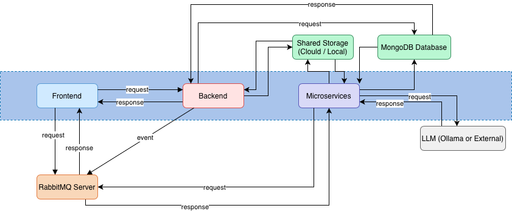

# Dallosh Analysis

> An innovative data analysis platform for automating customer reclamation/complaint processing for Telecom Companies using AI-powered sentiment analysis and data visualization.

[French Version](./FR_Readme.md)

## Table of Contents

- [Description](#description)
- [Preview](#preview)
- [System Architecture](#system-architecture)
- [Features](#features)
- [Quick Start](#quick-start)
- [Documentation](#documentation)
- [Team](#team)
- [License](#license)

## Description

Dallosh Analysis is a comprehensive data analysis application designed to automate the processing of customer complaint datasets for Telecom Companies. The platform enables data analysts to upload CSV files containing Twitter posts, automatically processes them through AI-powered sentiment analysis, and provides intuitive visualizations including charts, pie diagrams, and KPIs.

The application processes Twitter datasets with columns such as `id`, `created_at`, `full_text`, `media`, `screen_name`, and various engagement metrics. After processing through the backend and microservices, additional columns are added: `sentiment`, `priority`, and `topic`.

## Preview


*Admin Tasks Management Dashboard - Real-time task monitoring and processing with activity logs*

### Key Workflow

1. **Upload**: Data analysts upload CSV files through the web interface
2. **Queue**: Files are added to a processing queue
3. **Process**: Automated background processing includes:
   - Data cleaning (removing emojis, special characters)
   - Sentiment analysis (negative, neutral, positive)
   - Priority classification (0, 1, 2)
   - Topic extraction
   - Column appending and file saving
4. **Visualize**: Results are displayed with interactive charts and KPIs

## System Architecture



More details for the diagram here: [Architecture](./docs/architecture.md "Go To more details for the aarchitecture.")

### Architecture Overview

The system is organized into three main layers as follow:

**Frontend Layer:**

- **Frontend** (Next.js) - User interface
- **RabbitMQ Server** - Message broker for real-time communication

**Backend Layer:**

- **Backend** (Express.js) - REST API server
- **MongoDB Database** (SHARED) - Database for data storage
- **Shared Storage** (SHARED) - File storage (Local/AWS/Azure/etc.)

**Microservices Layer:**

- **Microservices** (Celery) - Background task processing
- **LLM** (Ollama or External) - AI/ML processing service

### Component Connections

**Frontend:**

- Connects to Backend (REST API)
- Connects to RabbitMQ Server (Subscribe)

**Backend:**

- Connects to MongoDB Database
- Connects to Shared Storage
- Connects to RabbitMQ Server (Publish/Subscribe)
- Connects to Microservices

**Microservices:**

- Connects to MongoDB Database (SHARED)
- Connects to Shared Storage (SHARED)
- Connects to RabbitMQ Server (Publish)
- Connects to LLM (Ollama or External)

**Shared Resources:**

- **MongoDB Database** - Used by Backend AND Microservices
- **Shared Storage** - Used by Backend AND Microservices

> 📚 For detailed architecture documentation, see [Architecture Documentation](./docs/architecture.md)

## Features

### Frontend

- **Modern UI**: Built with Next.js 16, React 19, and Tailwind CSS
- **Theme Support**: Red theme with light/dark mode switching
- **Role-Based Access Control**: Separate dashboards for admins and data analysts
- **Real-time Updates**: Live task progression tracking via RabbitMQ events
- **Data Visualization**: Interactive charts and diagrams using Recharts
- **Responsive Design**: Mobile-first approach with modern UX

### Backend

- **RESTful API**: Express.js server with modular architecture
- **JWT Authentication**: Secure token-based authentication
- **File Management**: CSV upload, preview, and download
- **Task Management**: Queue management for dataset processing
- **Activity Logging**: Comprehensive logging system
- **Settings Management**: Configurable AI models and storage options

### Microservices

- **Automated Processing**: Celery-based task processing
- **AI Integration**: Ollama LLM for sentiment analysis and topic extraction
- **Data Cleaning**: Intelligent text cleaning while preserving important data
- **Event-Driven**: RabbitMQ-based event communication
- **Resumable Tasks**: Pause, resume, and retry capabilities
- **Error Handling**: Robust error handling with retry mechanisms

## 🚀 Quick Start

### Prerequisites

- **Node.js** 18+ (for backend and frontend)
- **Python** 3.10+ (for microservices)
- **MongoDB** 7.0+ (running on localhost:27017)
- **RabbitMQ** 3.x (running on localhost:5672)
- **Ollama** (for LLM processing)
- **Docker** & **Docker Compose** (optional, for containerized deployment)

### Quick Start with Docker Compose (Recommended)

1. **Clone the repository:**

   ```bash
   git clone <repository-url>
   cd dalloh_analysis
   ```
2. **Set up environment variables:**

   - Copy `.env.example` to `.env` in each service directory:
     - `backend/.env.example` → `backend/.env`
     - `frontend/.env.local.example` → `frontend/.env.local`
     - `microservices/auto_processing_datasets/.env.example` → `microservices/auto_processing_datasets/.env`
3. **Start all services:**

   ```bash
   docker-compose up -d
   ```
4. **Access the application:**

   - Frontend: http://localhost:3006
   - Backend API: http://localhost:5006
   - RabbitMQ Management: http://localhost:15672 (admin/admin123)
   - MongoDB: localhost:27019

### Default Credentials

- **Admin User:**

  - Email: `admin@free.com`
  - Password: `admin123`
- **Analyst User:**

  - Email: `user@free.com`
  - Password: `user123`

**⚠️ Important:** Change default passwords in production!

> For detailed setup instructions, see [Getting Started Guide](./docs/README.md#quick-links)

## Documentation

Comprehensive technical documentation is available in the [`docs`](./docs/) directory:

### Technical Documentation

- **[Architecture](./docs/architecture.md)** - Detailed system architecture and deployment
- **[Sequence Diagrams](./docs/sequence-diagrams.md)** - Data flow and sequence diagrams
- **[Database Schema](./docs/database-schema.md)** - Database structure and relationships
- **[API Documentation](./docs/api-documentation.md)** - Complete REST API reference
- **[Component Interactions](./docs/component-interactions.md)** - Component communication details
- **[Process Flows](./docs/processes.md)** - Detailed process documentation
- **[Use Cases](./docs/use-cases.md)** - Use case documentation
- **[Class Diagram](./docs/class-diagram.md)** - Class structure and relationships

### Service-Specific Documentation

- **[Backend README](./backend/README.md)** - Backend-specific documentation
- **[Frontend README](./frontend/README.md)** - Frontend-specific documentation
- **[Microservice README](./microservices/auto_processing_datasets/README.md)** - Microservice-specific documentation

> 📖 For a complete documentation index, see [Documentation Index](./docs/README.md)

## Technologies

### Frontend

- **Next.js 16** - React framework with App Router
- **React 19** - UI library
- **TypeScript** - Type safety
- **Tailwind CSS** - Utility-first CSS framework
- **Shadcn UI** - Accessible component library
- **Zustand** - State management
- **Axios** - HTTP client
- **Recharts** - Data visualization
- **AMQP Lib** - RabbitMQ client for real-time updates
- **PapaParse** - CSV parsing

### Backend

- **Express.js 5** - Web application framework
- **TypeScript** - Type safety
- **MongoDB** - Database
- **JWT** - Authentication
- **Multer** - File upload handling
- **AMQP Lib** - RabbitMQ integration
- **bcryptjs** - Password hashing
- **PapaParse** - CSV parsing

### Microservices

- **Python 3.10+** - Programming language
- **Celery** - Distributed task queue
- **RabbitMQ** - Message broker
- **Pandas** - Data manipulation
- **Ollama** - LLM API client
- **Pika** - RabbitMQ Python client
- **PyMongo** - MongoDB driver
- **Pytest** - Testing framework

### Infrastructure

- **Docker** - Containerization
- **Docker Compose** - Multi-container orchestration
- **Traefik** - Reverse proxy (production)
- **MongoDB** - Database
- **RabbitMQ** - Message broker
- **Ollama** - LLM server

## Team

- **Ivan Joel SOBGUI**
- **Armel Cyrille BOTI**
- **Pascal Aurèle ELOUMOU MBOUDOU**
- **Oumar BEN LOL**
- **Mohammed SGHIOURI**
- **Nagui DIVENGI KIBANGUDI BUNKEMBO**


## License

This project is licensed under the MIT License.

---

## Contributing

Contributions are welcome! Please feel free to submit a Pull Request.

## Support

For issues and questions, please open an issue on the GitHub repository.
