# Dallosh Analysis

Analyse des Tweets SAV Free Mobile & Stratégie

<div class="abs-br m-6 flex gap-2">
  <a href="https://github.com/sobgui/dallosh_analysis" target="_blank" alt="GitHub"
    class="text-xl slidev-icon-btn opacity-50 !border-none !hover:text-white">
    <carbon-logo-github />
  </a>
</div>

<div class="mt-12">
  <span class="text-xl text-gray-400">Bloc CC2 - Analyse, Architecture & Stratégie</span>
</div>

<div class="mt-16 grid grid-cols-3 gap-y-8 gap-x-12 text-lg px-20">
  <div class="flex items-center gap-3"><carbon-user-avatar-filled class="text-blue-500"/> Ivan Joel SOBGUI</div>
  <div class="flex items-center gap-3"><carbon-user-avatar-filled class="text-blue-500"/> Armel Cyrille</div>
  <div class="flex items-center gap-3"><carbon-user-avatar-filled class="text-blue-500"/> Pascal</div>
  <div class="flex items-center gap-3"><carbon-user-avatar-filled class="text-blue-500"/> OUMAR Ben Lol</div>
  <div class="flex items-center gap-3"><carbon-user-avatar-filled class="text-blue-500"/> Mohammed SGHIOURI</div>
  <div class="flex items-center gap-3"><carbon-user-avatar-filled class="text-blue-500"/> Nagui</div>
</div>

---
layout: default
---

# Contexte & Défi

<div class="grid grid-cols-2 gap-12 mt-12">

<div v-click>
  <h3 class="text-2xl mb-4 flex items-center gap-3 text-blue-600">
    <carbon-data-blob /> La Donnée Brute
  </h3>
  <ul class="space-y-4">
    <li class="flex items-center gap-2"><carbon-logo-twitter class="text-blue-400"/> Export de <strong>~5000 tweets</strong> @FreeMobile</li>
    <li class="flex items-center gap-2"><carbon-warning-alt class="text-yellow-500"/> Données brutes, hétérogènes, bruitées</li>
    <li class="flex items-center gap-2"><carbon-chat class="text-gray-500"/> Plaintes, questions, spam, humour</li>
  </ul>
</div>

<div v-click>
  <h3 class="text-2xl mb-4 flex items-center gap-3 text-green-600">
    <carbon-chart-line-data /> Le Défi
  </h3>
  <div class="bg-gray-50 dark:bg-gray-800 p-6 rounded-xl border-l-4 border-green-500">
    Transformer ce "bruit" en <strong>outil décisionnel</strong> :
    <div class="mt-4 space-y-2">
      <div class="flex items-center gap-2"><carbon-filter /> 1. Filtrer le non-pertinent</div>
      <div class="flex items-center gap-2"><carbon-flow /> 2. Structurer (Topics, Sentiments)</div>
      <div class="flex items-center gap-2"><carbon-warning-filled /> 3. Prioriser les actions</div>
    </div>
  </div>
</div>

</div>

---
layout: default
---

# Architecture Système

Une architecture microservices événementielle.

<div class="grid grid-cols-2 gap-8 mt-4 h-[400px]">

<div class="flex flex-col justify-center h-full">
  
</div>

<div class="grid grid-cols-2 gap-4">
  <div v-click class="flex items-center gap-3 p-2 rounded hover:bg-gray-50 dark:hover:bg-gray-800 border border-transparent hover:border-gray-200 transition-all">
    <div class="p-2 bg-blue-100 rounded-lg text-blue-600"><carbon-application-web class="text-xl"/></div>
    <div>
      <h3 class="font-bold text-sm">Frontend</h3>
      <p class="text-xs opacity-75">Next.js 16, React 19.</p>
    </div>
  </div>

  <div v-click class="flex items-center gap-3 p-2 rounded hover:bg-gray-50 dark:hover:bg-gray-800 border border-transparent hover:border-gray-200 transition-all">
    <div class="p-2 bg-green-100 rounded-lg text-green-600"><carbon-api class="text-xl"/></div>
    <div>
      <h3 class="font-bold text-sm">Backend</h3>
      <p class="text-xs opacity-75">Node.js, Express.</p>
    </div>
  </div>

  <div v-click class="flex items-center gap-3 p-2 rounded hover:bg-gray-50 dark:hover:bg-gray-800 border border-transparent hover:border-gray-200 transition-all">
    <div class="p-2 bg-purple-100 rounded-lg text-purple-600"><carbon-machine-learning-model class="text-xl"/></div>
    <div>
      <h3 class="font-bold text-sm">Processing</h3>
      <p class="text-xs opacity-75">Python, Celery, Ollama.</p>
    </div>
  </div>

  <div v-click class="flex items-center gap-3 p-2 rounded hover:bg-gray-50 dark:hover:bg-gray-800 border border-transparent hover:border-gray-200 transition-all">
    <div class="p-2 bg-orange-100 rounded-lg text-orange-600"><carbon-data-base class="text-xl"/></div>
    <div>
      <h3 class="font-bold text-sm">Data</h3>
      <p class="text-xs opacity-75">MongoDB, RabbitMQ.</p>
    </div>
  </div>
</div>

</div>

---

# Architecture Base de Données

Schéma MongoDB pour la persistance des données.

<div class="grid grid-cols-3 gap-4 mt-8">
  <div class="p-4 bg-gray-50 dark:bg-gray-800 rounded-lg border border-gray-200 shadow-sm">
    <div class="flex items-center gap-2 mb-2 text-blue-600 font-bold"><carbon-user-filled /> Users & Roles</div>
    <p class="text-xs opacity-75">Gestion des utilisateurs, authentification et permissions (RBAC).</p>
  </div>
  <div class="p-4 bg-gray-50 dark:bg-gray-800 rounded-lg border border-gray-200 shadow-sm">
    <div class="flex items-center gap-2 mb-2 text-green-600 font-bold"><carbon-document /> Files</div>
    <p class="text-xs opacity-75">Métadonnées des fichiers uploadés (CSV) et chemins de stockage.</p>
  </div>
  <div class="p-4 bg-gray-50 dark:bg-gray-800 rounded-lg border border-gray-200 shadow-sm">
    <div class="flex items-center gap-2 mb-2 text-purple-600 font-bold"><carbon-task /> Tasks</div>
    <p class="text-xs opacity-75">Suivi du pipeline de traitement (Nettoyage, Analyse, Statut).</p>
  </div>
  <div class="p-4 bg-gray-50 dark:bg-gray-800 rounded-lg border border-gray-200 shadow-sm">
    <div class="flex items-center gap-2 mb-2 text-orange-600 font-bold"><carbon-settings /> Settings</div>
    <p class="text-xs opacity-75">Configuration dynamique de l'IA et du stockage.</p>
  </div>
  <div class="p-4 bg-gray-50 dark:bg-gray-800 rounded-lg border border-gray-200 shadow-sm">
    <div class="flex items-center gap-2 mb-2 text-red-600 font-bold"><carbon-catalog /> Logs</div>
    <p class="text-xs opacity-75">Traçabilité des actions et audit de sécurité.</p>
  </div>
</div>

<div class="mt-4 flex gap-8 justify-center text-sm opacity-75">
  <div v-click><carbon-user-access /> <strong>RBAC</strong> : Gestion fine des droits</div>
  <div v-click><carbon-task /> <strong>Traçabilité</strong> : Suivi complet des tâches</div>
  <div v-click><carbon-settings /> <strong>Config</strong> : Paramètres IA dynamiques</div>
</div>

---

# Structure du Projet

Organisation modulaire du code source.

<div class="grid grid-cols-2 gap-6 mt-8">

  <!-- Frontend Card -->
  <div v-click class="p-4 bg-blue-50 dark:bg-blue-900/20 rounded-xl border border-blue-100 dark:border-blue-800 shadow-sm hover:shadow-md transition-shadow">
    <div class="flex items-center gap-3 mb-3">
      <div class="p-2 bg-blue-500 text-white rounded-lg"><carbon-application-web class="text-xl"/></div>
      <h3 class="font-bold text-lg">Frontend</h3>
    </div>
    <ul class="space-y-2 text-sm opacity-80 ml-2">
      <li class="flex items-center gap-2"><carbon-folder class="text-blue-400"/> <strong>app/</strong> <span class="text-xs opacity-60">Pages Next.js</span></li>
      <li class="flex items-center gap-2"><carbon-folder class="text-blue-400"/> <strong>components/</strong> <span class="text-xs opacity-60">UI Shadcn</span></li>
      <li class="flex items-center gap-2"><carbon-folder class="text-blue-400"/> <strong>lib/</strong> <span class="text-xs opacity-60">Utils & Hooks</span></li>
    </ul>
  </div>

  <!-- Backend Card -->
  <div v-click class="p-4 bg-green-50 dark:bg-green-900/20 rounded-xl border border-green-100 dark:border-green-800 shadow-sm hover:shadow-md transition-shadow">
    <div class="flex items-center gap-3 mb-3">
      <div class="p-2 bg-green-500 text-white rounded-lg"><carbon-api class="text-xl"/></div>
      <h3 class="font-bold text-lg">Backend</h3>
    </div>
    <ul class="space-y-2 text-sm opacity-80 ml-2">
      <li class="flex items-center gap-2"><carbon-folder class="text-green-400"/> <strong>api/</strong> <span class="text-xs opacity-60">Routes REST</span></li>
      <li class="flex items-center gap-2"><carbon-folder class="text-green-400"/> <strong>models/</strong> <span class="text-xs opacity-60">Schémas Mongoose</span></li>
      <li class="flex items-center gap-2"><carbon-folder class="text-green-400"/> <strong>services/</strong> <span class="text-xs opacity-60">Logique métier</span></li>
    </ul>
  </div>

  <!-- Microservices Card -->
  <div v-click class="p-4 bg-purple-50 dark:bg-purple-900/20 rounded-xl border border-purple-100 dark:border-purple-800 shadow-sm hover:shadow-md transition-shadow">
    <div class="flex items-center gap-3 mb-3">
      <div class="p-2 bg-purple-500 text-white rounded-lg"><carbon-machine-learning-model class="text-xl"/></div>
      <h3 class="font-bold text-lg">Microservices</h3>
    </div>
    <ul class="space-y-2 text-sm opacity-80 ml-2">
      <li class="flex items-center gap-2"><carbon-script class="text-purple-400"/> <strong>cleaning.py</strong> <span class="text-xs opacity-60">Nettoyage</span></li>
      <li class="flex items-center gap-2"><carbon-script class="text-purple-400"/> <strong>calling_llm.py</strong> <span class="text-xs opacity-60">IA (Ollama)</span></li>
      <li class="flex items-center gap-2"><carbon-script class="text-purple-400"/> <strong>saving.py</strong> <span class="text-xs opacity-60">Persistance</span></li>
    </ul>
  </div>

  <!-- Docs & Config Card -->
  <div v-click class="p-4 bg-orange-50 dark:bg-orange-900/20 rounded-xl border border-orange-100 dark:border-orange-800 shadow-sm hover:shadow-md transition-shadow">
    <div class="flex items-center gap-3 mb-3">
      <div class="p-2 bg-orange-500 text-white rounded-lg"><carbon-settings class="text-xl"/></div>
      <h3 class="font-bold text-lg">Docs & Config</h3>
    </div>
    <ul class="space-y-2 text-sm opacity-80 ml-2">
      <li class="flex items-center gap-2"><carbon-folder class="text-orange-400"/> <strong>docs/</strong> <span class="text-xs opacity-60">Architecture & Rapports</span></li>
      <li class="flex items-center gap-2"><carbon-document class="text-orange-400"/> <strong>docker-compose.yml</strong> <span class="text-xs opacity-60">Orchestration</span></li>
      <li class="flex items-center gap-2"><carbon-document class="text-orange-400"/> <strong>README.md</strong> <span class="text-xs opacity-60">Documentation</span></li>
    </ul>
  </div>

</div>

---
layout: default
---

# Interface Utilisateur

Une expérience moderne et intuitive.

<div class="grid grid-cols-2 gap-4 mt-4">
  <div class="relative group h-48 flex justify-center items-center bg-gray-50 rounded overflow-hidden">
    
    <div class="absolute bottom-2 left-2 bg-black/70 text-white px-2 py-1 text-xs rounded">Dashboard Global</div>
  </div>
  <div class="relative group h-48 flex justify-center items-center bg-gray-50 rounded overflow-hidden">
    
    <div class="absolute bottom-2 left-2 bg-black/70 text-white px-2 py-1 text-xs rounded">Suivi des Tâches</div>
  </div>
  <div class="relative group h-48 flex justify-center items-center bg-gray-50 rounded overflow-hidden">
    
    <div class="absolute bottom-2 left-2 bg-black/70 text-white px-2 py-1 text-xs rounded">Analytics & KPIs</div>
  </div>
  <div class="relative group h-48 flex justify-center items-center bg-gray-50 rounded overflow-hidden">
    
    <div class="absolute bottom-2 left-2 bg-black/70 text-white px-2 py-1 text-xs rounded">Configuration IA</div>
  </div>
</div>

---

# Pipeline de Traitement (ETL)

Processus automatisé de transformation de la donnée.

```mermaid {scale: 0.8}
graph LR
    A[Ingestion CSV] --> B(Nettoyage)
    B --> C{Enrichissement IA}
    C -->|Sentiment| D[Base de Données]
    C -->|Topic| D
    C -->|Priorité| D
    D --> E[Visualisation]
    
    style A fill:#f9f,stroke:#333,stroke-width:2px
    style C fill:#bbf,stroke:#333,stroke-width:2px
    style E fill:#bfb,stroke:#333,stroke-width:2px
```



<div class="grid grid-cols-3 gap-6 mt-8">

<div v-click class="card border-t-4 border-t-purple-500">
  <div class="text-3xl mb-2">🧹</div>
  <h3 class="font-bold">1. Nettoyage</h3>
  <p class="text-sm mt-2">Regex pour emojis, suppression des doublons, masquage des PII.</p>
</div>

<div v-click class="card border-t-4 border-t-blue-500">
  <div class="text-3xl mb-2">🧠</div>
  <h3 class="font-bold">2. Enrichissement</h3>
  <p class="text-sm mt-2">Appel LLM pour déterminer : Sentiment, Topic, Urgence.</p>
</div>

<div v-click class="card border-t-4 border-t-green-500">
  <div class="text-3xl mb-2">💾</div>
  <h3 class="font-bold">3. Stockage</h3>
  <p class="text-sm mt-2">Sauvegarde structurée dans MongoDB pour requêtage rapide.</p>
</div>

</div>

<style>
.card {
  @apply p-4 bg-white dark:bg-gray-800 shadow-md rounded-lg;
}
</style>

---

# Santé du SAV - KPIs

Diagnostic global basé sur l'analyse des données.

<div class="grid grid-cols-3 gap-6 mt-12">

<div v-click class="text-center p-6 bg-red-50 dark:bg-red-900/20 rounded-2xl border border-red-100 dark:border-red-900">
  <div class="text-5xl font-bold text-red-500 mb-2">NSS</div>
  <div class="text-sm font-bold uppercase tracking-wider opacity-60">Net Sentiment Score</div>
  <div class="mt-4 text-sm">Indicateur de la satisfaction globale. Négatif structurellement en SAV.</div>
</div>

<div v-click class="text-center p-6 bg-orange-50 dark:bg-orange-900/20 rounded-2xl border border-orange-100 dark:border-orange-900">
  <div class="text-5xl font-bold text-orange-500 mb-2">High</div>
  <div class="text-sm font-bold uppercase tracking-wider opacity-60">Priorité Critique</div>
  <div class="mt-4 text-sm">Tweets nécessitant une intervention < 1h (Urgence, Panne).</div>
</div>

<div v-click class="text-center p-6 bg-blue-50 dark:bg-blue-900/20 rounded-2xl border border-blue-100 dark:border-blue-900">
  <div class="text-5xl font-bold text-blue-500 mb-2"><carbon-share /></div>
  <div class="text-sm font-bold uppercase tracking-wider opacity-60">Viralité</div>
  <div class="mt-4 text-sm">Forte corrélation entre sentiment négatif et nombre de Retweets.</div>
</div>

</div>

---

# Analyse des Thématiques

De quoi parlent les abonnés Free ?

<div class="grid grid-cols-2 gap-12 mt-8">

<div class="space-y-6">
  <div v-click class="flex items-start gap-4 p-4 rounded-lg hover:bg-gray-50 dark:hover:bg-gray-800 transition-colors">
    <div class="text-red-500 text-2xl mt-1"><carbon-warning-filled /></div>
    <div>
      <h3 class="font-bold text-lg">Réseau / Fibre</h3>
      <p class="opacity-80 text-sm">60% du volume négatif. Mots-clés : "Urgent", "Injoignable", "Coupure".</p>
    </div>
  </div>
  
  <div v-click class="flex items-start gap-4 p-4 rounded-lg hover:bg-gray-50 dark:hover:bg-gray-800 transition-colors">
    <div class="text-yellow-500 text-2xl mt-1"><carbon-document /></div>
    <div>
      <h3 class="font-bold text-lg">Administratif / Facture</h3>
      <p class="opacity-80 text-sm">Sentiment mitigé. Problèmes de compréhension ou délais.</p>
    </div>
  </div>
  
  <div v-click class="flex items-start gap-4 p-4 rounded-lg hover:bg-gray-50 dark:hover:bg-gray-800 transition-colors">
    <div class="text-green-500 text-2xl mt-1"><carbon-user-follow /></div>
    <div>
      <h3 class="font-bold text-lg">Nouveaux Abonnés</h3>
      <p class="opacity-80 text-sm">Seul vecteur positif (Livraison rapide, Activation).</p>
    </div>
  </div>
</div>

<div class="flex items-center justify-center">
  ```mermaid
  pie title Répartition des Topics
    "Réseau/Tech" : 60
    "Facturation" : 25
    "Commercial" : 10
    "Autre" : 5
  ```
</div>

</div>

---

# Recommandations Opérationnelles

Transformer l'analyse en action concrète.

<div class="grid grid-cols-3 gap-6 mt-12">

<div v-click class="relative p-6 bg-white dark:bg-gray-800 rounded-xl shadow-lg border-t-4 border-purple-500">
  <div class="absolute -top-4 left-6 bg-purple-500 text-white p-2 rounded-lg shadow-md"><carbon-filter /></div>
  <h3 class="font-bold text-xl mt-4 mb-2">Filtrage Prioritaire</h3>
  <p class="text-sm opacity-80">Les agents ne traitent que les tweets <strong>"High Priority"</strong>. Fin du traitement chronologique.</p>
</div>

<div v-click class="relative p-6 bg-white dark:bg-gray-800 rounded-xl shadow-lg border-t-4 border-blue-500">
  <div class="absolute -top-4 left-6 bg-blue-500 text-white p-2 rounded-lg shadow-md"><carbon-direction-fork /></div>
  <h3 class="font-bold text-xl mt-4 mb-2">Routage Intelligent</h3>
  <p class="text-sm opacity-80">Aiguillage auto via <code>main_topic</code> :<br>Réseau → Tech<br>Facture → Commerce.</p>
</div>

<div v-click class="relative p-6 bg-white dark:bg-gray-800 rounded-xl shadow-lg border-t-4 border-red-500">
  <div class="absolute -top-4 left-6 bg-red-500 text-white p-2 rounded-lg shadow-md"><carbon-notification /></div>
  <h3 class="font-bold text-xl mt-4 mb-2">Alerte Proactive</h3>
  <p class="text-sm opacity-80">Notification automatique si >30% de priorité haute en 1h (Détection d'incident).</p>
</div>

</div>

---

# Stratégie FinOps & Infrastructure

Optimiser les coûts tout en gardant la performance.

<div class="grid grid-cols-2 gap-12 mt-8">

<div>
  <h3 class="text-xl font-bold mb-4 flex items-center gap-2"><carbon-cloud-service-management /> Modèle Hybride</h3>
  <ul class="space-y-4">
    <li v-click class="flex items-center gap-3">
      <span class="bg-green-100 text-green-700 px-2 py-1 rounded text-xs font-bold">NOMINAL</span>
      <span>API Externes (Gemini Flash - Gratuit)</span>
    </li>
    <li v-click class="flex items-center gap-3">
      <span class="bg-blue-100 text-blue-700 px-2 py-1 rounded text-xs font-bold">SENSIBLE</span>
      <span>Modèles Locaux (Mistral - Souverain)</span>
    </li>
    <li v-click class="flex items-center gap-3">
      <span class="bg-red-100 text-red-700 px-2 py-1 rounded text-xs font-bold">FALLBACK</span>
      <span>GPU On-Premise en cas de coupure</span>
    </li>
  </ul>
</div>

<div>
  <h3 class="text-xl font-bold mb-4 flex items-center gap-2"><carbon-calculator /> Smart Batching</h3>
  <p class="text-sm mb-4 opacity-75">Optimisation des tokens pour réduire la facture API.</p>
  
  <table class="w-full text-sm">
    <thead class="bg-gray-100 dark:bg-gray-800">
      <tr>
        <th class="p-2 text-left">Prio</th>
        <th class="p-2 text-left">Modèle</th>
        <th class="p-2 text-left">Coût</th>
        <th class="p-2 text-left">Usage</th>
      </tr>
    </thead>
    <tbody>
      <tr v-click class="border-b border-gray-200 dark:border-gray-700">
        <td class="p-2 font-bold">1</td>
        <td class="p-2">Gemini 1.5</td>
        <td class="p-2 text-green-500">€</td>
        <td class="p-2">Tri de masse</td>
      </tr>
      <tr v-click class="border-b border-gray-200 dark:border-gray-700">
        <td class="p-2 font-bold">2</td>
        <td class="p-2">Mistral</td>
        <td class="p-2 text-blue-500">€€</td>
        <td class="p-2">Souverain</td>
      </tr>
      <tr v-click>
        <td class="p-2 font-bold">3</td>
        <td class="p-2">GPT-4o</td>
        <td class="p-2 text-red-500">€€€</td>
        <td class="p-2">VIP / Ambigu</td>
      </tr>
    </tbody>
  </table>
</div>

</div>

---

# Souveraineté & RGPD

Protéger les données des abonnés Free.

<div class="grid grid-cols-2 gap-12 mt-8">

<div class="bg-red-50 dark:bg-red-900/10 p-6 rounded-xl border border-red-100 dark:border-red-900/30">
  <h3 class="text-xl font-bold mb-4 text-red-600 flex items-center gap-2"><carbon-locked /> Le Dilemme</h3>
  <p>L'anonymisation totale fait perdre le contexte géographique (critique pour le réseau).</p>
  <div class="mt-4 text-sm italic opacity-75">"Une panne réseau sans localisation est impossible à résoudre."</div>
</div>

<div>
  <h3 class="text-xl font-bold mb-4 text-green-600 flex items-center gap-2"><carbon-security /> Nos Solutions</h3>
  <ul class="space-y-4">
    <li v-click class="flex items-start gap-3">
      <carbon-document-signed class="text-xl mt-1 text-blue-500"/>
      <div>
        <strong>Zero Data Retention</strong>
        <p class="text-sm opacity-75">Accords contractuels avec les fournisseurs API.</p>
      </div>
    </li>
    <li v-click class="flex items-start gap-3">
      <carbon-data-center class="text-xl mt-1 text-blue-500"/>
      <div>
        <strong>Local Hosting</strong>
        <p class="text-sm opacity-75">Les données ne quittent pas les serveurs Free.</p>
      </div>
    </li>
    <li v-click class="flex items-start gap-3">
      <carbon-clean class="text-xl mt-1 text-blue-500"/>
      <div>
        <strong>PII Scrubbing</strong>
        <p class="text-sm opacity-75">Nettoyage auto (Noms/Tél) avant envoi API publique.</p>
      </div>
    </li>
  </ul>
</div>

</div>

---
layout: center
class: text-center
---

# Conclusion

Dallosh Analysis transforme le bruit des réseaux sociaux en **stratégie claire**.

<div class="mt-12 grid grid-cols-3 gap-12 text-left">
  <div v-click class="transform hover:scale-105 transition-transform duration-300">
    <div class="text-4xl mb-4 text-green-500"><carbon-meter /></div>
    <strong class="text-xl">Efficacité</strong>
    <p class="text-sm mt-2 opacity-75">Réduction du temps de traitement grâce au filtrage IA.</p>
  </div>
  <div v-click class="transform hover:scale-105 transition-transform duration-300">
    <div class="text-4xl mb-4 text-blue-500"><carbon-chart-radar /></div>
    <strong class="text-xl">Visibilité</strong>
    <p class="text-sm mt-2 opacity-75">Détection temps réel des crises et incidents.</p>
  </div>
  <div v-click class="transform hover:scale-105 transition-transform duration-300">
    <div class="text-4xl mb-4 text-red-500"><carbon-locked /></div>
    <strong class="text-xl">Souveraineté</strong>
    <p class="text-sm mt-2 opacity-75">Maîtrise des coûts et des données.</p>
  </div>
</div>

<div class="mt-20 opacity-50">
  Merci de votre attention.<br>
  <span class="text-sm">Lien vers l'application : https://dallosh-analysis.agglomy.com/</span>
</div>
